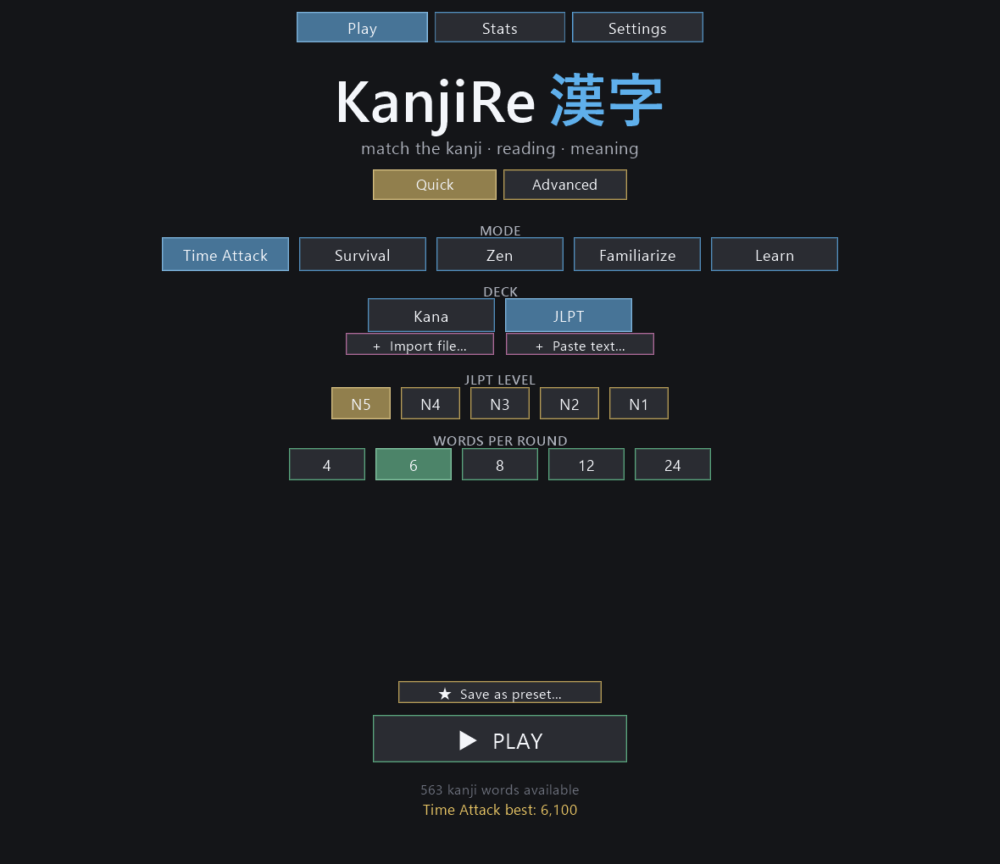
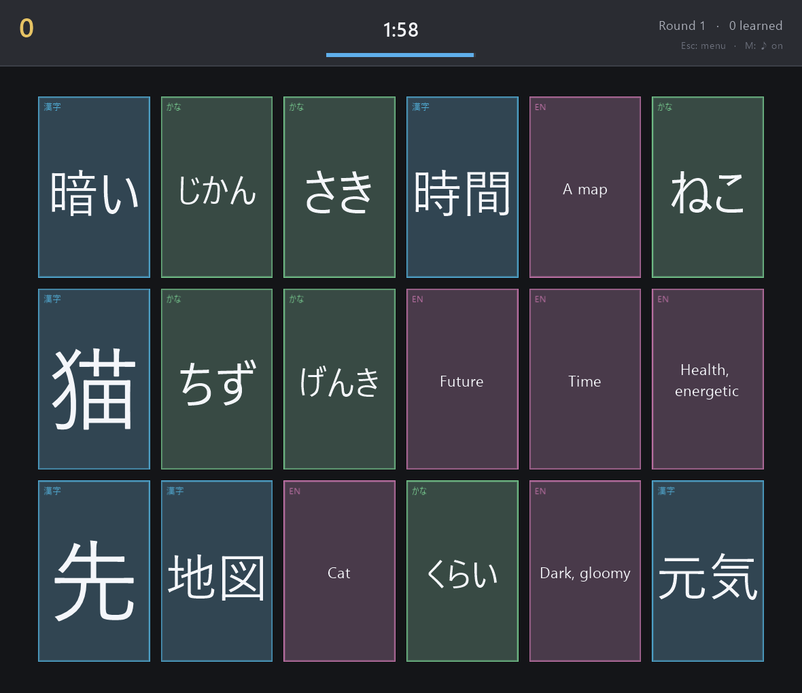

# KanjiRe 漢字

A fast-paced Japanese **kanji matching mini-game**. Each round deals a board of
cards; every word is split across three cards — its **kanji writing**, its
**hiragana reading**, and its **English meaning** — all shuffled together. Click
the cards that belong to the same word to group them. Clear the whole board to
advance; clear as many as you can before the timer runs out or you run out of
lives.

Inspired by the "Saeki's Kanji" matching mini-game in
[Wagotabi](https://www.wagotabi.com/), pulled out into a standalone study tool.




## Features

- **Three-way matching** across writing systems (kanji ⇄ reading ⇄ meaning), or a
  simpler two-card (kanji ⇄ meaning) mode.
- **Frequency-weighted** word selection — common words show up more often, with a
  tunable bias, so you study what actually matters first.
- **JLPT levels N5–N1** as selectable difficulty.
- **Learn from real text.** Feed in any Japanese text (file *or* pasted right
  in-game) and KanjiRe tokenises it, computes each word's reading and English
  meaning, and builds a deck weighted by how often words appear *in that text*.
  A ready-made deck mined from Japanese Wikipedia is included.
- **Familiarization mode** — same word set repeats 2×, 3× or 5×, each pass with
  a different random font *and* horizontal/vertical (tategaki) writing. 14
  visually distinct fonts (6 bundled + system).
- **Stats screen** with three tabs: **Overview** (totals, per-face mistake bars),
  **Words** (sortable scrollable table with search box; right-click any row to
  reset that word), **Kanji** (per-character aggregation of the same data).
- **Learn mode** — pulls a curated mix of *known / less-known / unknown* words
  from your cross-deck knowledge profile with three None/Few/Some/Many
  selectors. The more you play, the more accurate the mix.
- **Per-mode persistent settings** — every toggle change is auto-saved keyed by
  mode, so switching modes restores exactly where you left that mode.
- **Custom presets** — save the entire current configuration as a named preset
  that appears in the mode row; right-click to delete.
- **Audio**: synthesised SFX for select/match/mismatch and Japanese (Haruka)
  voice reading the reading on each match. On a mismatch involving the meaning
  card, English (Zira) reads that meaning so you hear what you were confused
  about. Three independent toggles in Settings: speak on select / match /
  mismatch. **M** toggles overall mute.
- **English / French interface** — full UI translation plus card meanings in
  either language. French glosses pulled from JMdict-simplified (82% coverage
  across N5–N1). Switch with the **EN / FR** buttons in Settings → Language.
- **Dark-neon arcade look** built on a pyglet game loop with smooth card
  animations (select pop, match float, mismatch shake). **F11** fullscreen.

## Requirements

- Python 3.10+ (developed on 3.13)
- The packages in [`requirements.txt`](requirements.txt). The **game itself**
  only needs `pyglet`; the others are for building/importing decks offline.

```bash
pip install -r requirements.txt
```

## Setup (build the data once)

```bash
python scripts/setup_data.py
```

This runs the four preparation steps:

1. **`scripts/fetch_jamdict_data.py`** — installs the JMdict + KanjiDic2 SQLite
   database to `~/.jamdict/` (used to resolve readings/meanings when ingesting
   text). Done this way because the `jamdict-data` pip package fails to build on
   Windows.
2. **`scripts/fetch_fonts.py`** — downloads six free (SIL OFL) Japanese fonts
   into `kanjire/fonts/` for familiarization mode (pixel, brush, handwritten,
   pop, comic, rounded-gothic). License files are kept alongside each font.
3. **`scripts/build_jlpt_dataset.py`** — downloads the N5–N1 word lists, weights
   them by frequency, and writes the `jlpt` deck into
   `kanjire/data/kanjire.db`.
4. **`scripts/fetch_sample_corpus.py`** — downloads a few Japanese Wikipedia
   articles and ingests them into the `corpus:wikipedia` deck.

Use `python scripts/setup_data.py --no-corpus` to skip the (slower) step 4.

## Play

```bash
python main.py            # or:  python -m kanjire
```

**Controls**

| Action | How |
| --- | --- |
| Select / group cards | Left click |
| Deselect a card | Click it again |
| Confirm / play again | Enter or Space |
| Back to menu | Esc |

Pick a mode, deck, JLPT level(s), board size and card count on the menu, then
**Play**.

## Learn from your own text

Three equivalent ways:

| In-game           | What to click                                       |
| ----------------- | --------------------------------------------------- |
| File on disk      | menu → **+ Import file…** → pick a `.txt`           |
| Paste it directly | menu → **+ Paste text…** → paste, name it, *Ingest* |
| Command line      | `python scripts/ingest_corpus.py path/to/text.txt`  |

The new deck shows up in the **Deck** row. Words are weighted by their frequency
in *your* text — read a chapter, then drill its vocabulary.

## Custom presets

Every option in the menu (mode, deck, level, faces, board size, fonts, writing,
passes) is freely combinable. Hit **★ Save as preset…**, name it, and the
combination appears as a new button in the **MODE** row that restores every
setting in one click. **Right-click** a saved preset to delete it.

## How it works

```
kanjire/
  model/        Word dataclass + frequency-weighted, collision-free sampling
  game/         Pure, GUI-free rules: GameConfig + GameEngine (fully unit-tested)
  data/         SQLite access layer + the corpus-ingestion pipeline
  ui/           pyglet front-end: window, scenes (menu/game/results), widgets
scripts/        Offline tools: dataset build, corpus ingest, sample fetch, setup
tests/          Engine unit tests, DB integration tests, UI smoke + screenshots
```

The game logic is deliberately separated from rendering: `kanjire.game.engine`
has no pyglet imports and is covered by `tests/test_engine.py`. The pyglet layer
just turns engine events into animations.

**Ingestion pipeline** (`kanjire/data/ingest.py`): fugashi (MeCab + UniDic)
tokenises the text and gives each token a dictionary form and reading; content
words containing kanji are kept and counted; jamdict (JMdict) supplies the
English meaning, with the tokenizer's reading used to disambiguate entries
(so 本 → ほん/"book", not もと/"origin"). KanjiDic2 supplies each kanji's grade and
JLPT level. Everything is baked into the SQLite database, so the game needs none
of these libraries at runtime.

## Testing

```bash
python tests/test_engine.py     # pure engine rules
python tests/test_db.py         # integration against the built database
python tests/smoke_ui.py        # drives menu->game->results headlessly
python tests/capture_screens.py # writes screenshots to tests/_shots/
```

(They also run under `pytest` if you have it: `pytest tests/`.)

## Data sources & licensing

- **Vocabulary / readings / meanings:** [JMdict] and [KanjiDic2] via
  [jamdict] — © the Electronic Dictionary Research and Development Group,
  used under the EDRDG licence.
- **JLPT word lists:** [open-anki-jlpt-decks] (MIT), derived from JMdict-based
  lists.
- **Frequencies:** [wordfreq] (a wide range of free corpora).
- **Sample corpus:** Japanese Wikipedia (CC BY-SA).

This project is a personal study tool; please respect the upstream licences of
the dictionary data.

[JMdict]: https://www.edrdg.org/jmdict/j_jmdict.html
[KanjiDic2]: https://www.edrdg.org/wiki/index.php/KANJIDIC_Project
[jamdict]: https://github.com/neocl/jamdict
[open-anki-jlpt-decks]: https://github.com/jamsinclair/open-anki-jlpt-decks
[wordfreq]: https://github.com/rspeer/wordfreq
